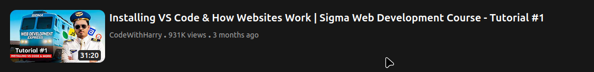

# YouTube Video Card Layout (Tailwind CSS)

This project is a **YouTube-style video card layout** built using **Tailwind CSS only**, without any custom CSS. Tailwind is configured using the **Tailwind CLI** and compiled locally.

The layout includes:

* Video thumbnail
* Video duration overlay
* Title
* Channel name
* View count and upload time
  All styled using utility classes from Tailwind CSS.

---

## 📸 Preview

A single YouTube video card centered on the screen with a dark theme, similar to YouTube’s UI.



---

## 🛠 Tech Stack

* **HTML**
* **Tailwind CSS**
* **Tailwind CLI**
* **Node.js & npm**

---

## 📁 Project Structure

```
project-root/
│
├── src/
│   ├── input.css      # Tailwind input file
│   └── output.css     # Generated Tailwind CSS
│
├── img/
│   └── hqdefault.webp # Thumbnail image
│
├── index.html
├── package-lock.json
├── package.json
└── README.md
```

---

## 📄 HTML Code Explanation

### 1. Tailwind CSS Linking

```html
<link rel="stylesheet" href="src/output.css">
```

The compiled Tailwind CSS file is linked directly to the HTML.

---

### 2. Page Layout

```html
<body class="flex justify-center items-center m-30 bg-neutral-800">
```

* Centers the card horizontally and vertically
* Uses a dark neutral background

---

### 3. Main Card Container

```html
<div class="container flex gap-2 p-5 text-white bg-neutral-900">
```

* Flex layout for thumbnail and text
* Padding and gap for spacing
* Dark background similar to YouTube dark mode

---

### 4. Thumbnail & Duration

```html
<div class="thumbnailContainer relative">
```

* `relative` positioning allows the duration badge to be placed absolutely

```html
<div class="duration absolute bottom-1 right-2 font-bold bg-neutral-800 rounded-sm text-sm px-1">
```

* Positioned at bottom-right of thumbnail
* Styled like YouTube’s duration badge

---

### 5. Text Content

```html
<div class="textContainer flex flex-col">
```

* Stacks title and description vertically

```html
<div class="title text-xl font-bold">
```

* Bold and large title

```html
<div class="description text-sm font-medium text-neutral-400">
```

* Subtle gray text for metadata (channel, views, time)

---

## ⚙️ Local Setup & Usage

Follow these steps to run and modify the project on your local machine.

### 1️⃣ Clone the Repository

```bash
git clone <your-repo-url>
cd <project-folder>
```

---

### 2️⃣ Install Dependencies

```bash
npm install
```

This installs Tailwind CSS and required dependencies.

---

### 3️⃣ Run Tailwind CLI

I already added a script in `package.json`:

```json
"scripts": {
  "build": "npx @tailwindcss/cli -i ./src/input.css -o ./src/output.css --watch"
}
```

Run it using:

```bash
npm run build
```

This will:

* Compile Tailwind CSS
* Watch for changes in `input.css` and HTML files
* Automatically update `output.css`

---

### 4️⃣ Open the Project

Simply open `index.html` in your browser.

---

## ✏️ How to Modify the Card

* **Change text** → Edit content inside `index.html`
* **Change styling** → Update Tailwind utility classes
* **Add more cards** → Duplicate the main container div
* **Change theme** → Modify background and text color classes

---

## 📌 Notes

* No custom CSS is used
* Tailwind is compiled locally using CLI
* Ideal for beginners learning Tailwind CSS layouts